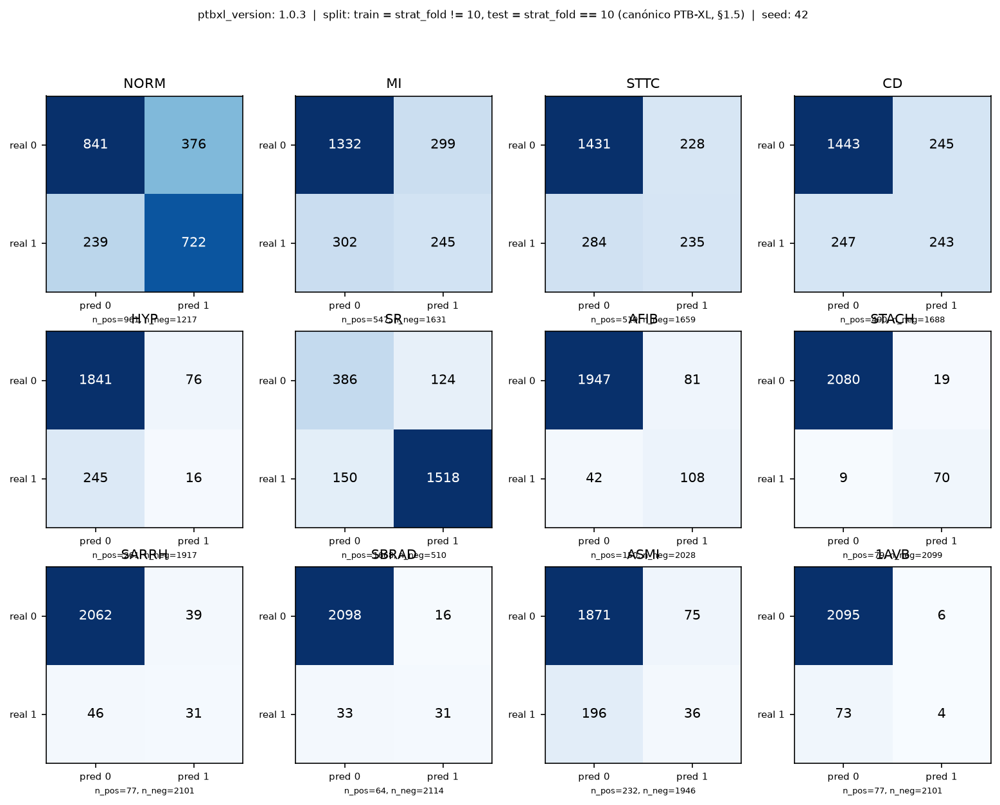
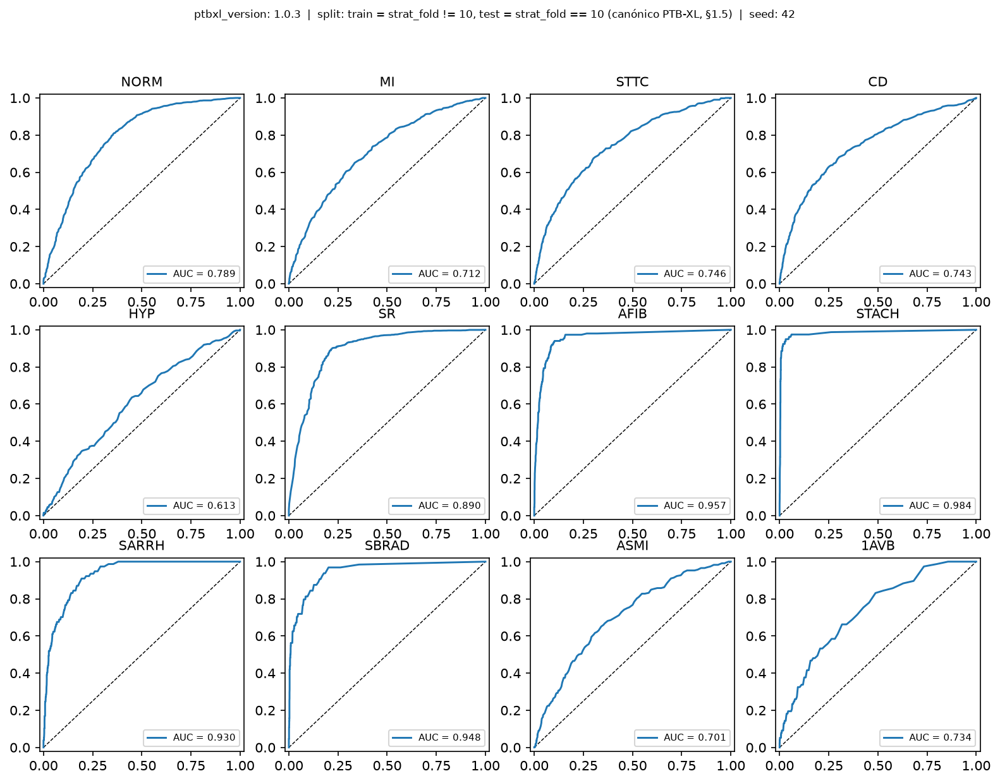
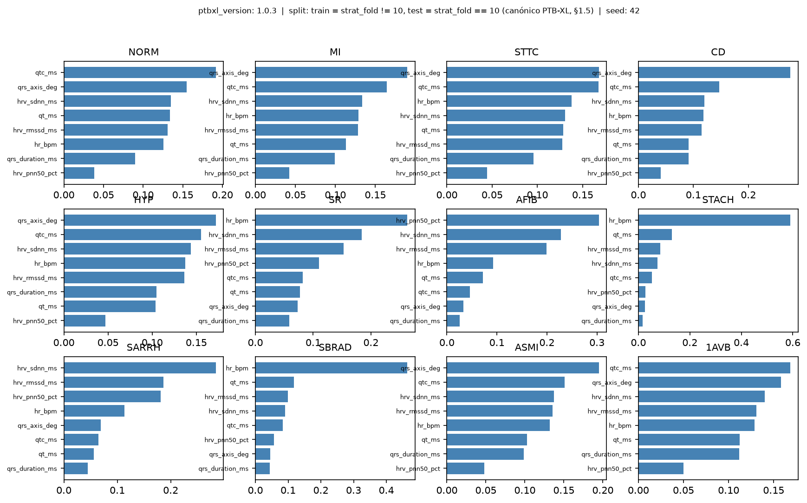

# SinusAI

Herramienta demostrativa de apoyo a la interpretación de electrocardiogramas (ECG/EKG),
pensada como recurso pedagógico para un taller. Muestra, en vivo, dónde una herramienta
de IA acierta y dónde tiene puntos ciegos.

> **Importante:** no es un producto clínico ni una validación diagnóstica. Su propósito
> es enseñar a cuándo confiar en una IA y cuándo no.

## Qué hace

El flujo general es:

1. **Carga del EKG**: acepta señales digitales WFDB de 12 derivaciones o imágenes PNG/JPG
   de un trazado estándar. Las imágenes se digitalizan a una señal temporal; el modelo
   nunca clasifica píxeles.
2. **Medición de características clínicas**: extrae ocho medidas interpretables:
   duración del QRS, QT, QTc, frecuencia cardiaca, eje QRS y tres medidas de HRV.
3. **Clasificación multietiqueta**: un Random Forest CPU-only produce probabilidades
   individuales para 12 salidas evaluadas, organizadas en tres ejes:
   - **Superclase:** `NORM`, `MI`, `STTC`, `CD`, `HYP`.
   - **Ritmo:** `SR`, `AFIB`, `STACH`, `SARRH`, `SBRAD`.
   - **Diagnóstico específico:** `ASMI`, `1AVB`.
4. **Resultado en vivo**: muestra el trazado, las probabilidades y los avisos de
   confianza baja, calidad degradada o datos insuficientes.
5. **Evaluación reproducible**: deja en `reports/` la matriz de confusión, las curvas
   ROC/AUC y la importancia de variables de la corrida documentada.

Los patrones declarados-no-evaluados, incluidos `VT`, `VF` y `NODAL`, no reciben una
probabilidad calculada: el sistema los muestra con el aviso de datos insuficientes. El
catálogo completo y su trazabilidad están en [`docs/label_mapping.md`](docs/label_mapping.md).

## Por qué es honesto por diseño

- El modelo trabaja sobre medidas clínicas de una señal temporal, no sobre la imagen como
  una fotografía.
- Las salidas con pocos datos no se presentan como predicciones confiables.
- Las clases con mala performance se conservan en las gráficas y se muestran sin suavizar.
- La app siempre recuerda que es una herramienta pedagógica y no un diagnóstico clínico.
- Los archivos cargados se procesan en temporales del sistema y se eliminan al cerrar la
  sesión; el dataset y los datos de pacientes no se versionan.

## Requisitos

- Python 3.11 o superior.
- Linux, macOS o Windows con soporte para las dependencias de Python del proyecto.
- CPU suficiente para el entrenamiento; no se requiere GPU.
- La versión de PTB-XL usada por la corrida de referencia es la **1.0.3** a 100 Hz.

## Configuración

Clona el repositorio y crea un entorno virtual:

```bash
python -m venv .venv
source .venv/bin/activate
python -m pip install -r requirements.txt
```

Descarga el dataset **PTB-XL** dentro de `data/ptb-xl/`:

```bash
mkdir -p data
aws s3 sync --no-sign-request s3://physionet-open/ptb-xl/1.0.3/ ./data/ptb-xl
```

La estructura mínima que espera el entrenamiento es:

```text
data/ptb-xl/
├── ptbxl_database.csv
├── scp_statements.csv
└── records100/
```

`data/` está ignorada por Git: el dataset no se sube al repositorio. El comando anterior
usa AWS CLI; si se descarga el archivo de otra forma, basta con conservar esa estructura.

## Dataset PTB-XL

[PTB-XL](https://physionet.org/content/ptb-xl/1.0.3/) es el conjunto de datos público y
desidentificado que se utiliza para extraer features y entrenar el modelo. La corrida de
referencia usa la versión **1.0.3** y las señales de baja frecuencia de **100 Hz**, no la
variante de 500 Hz.

### Contenido utilizado

- **21 799 registros** de 12 derivaciones, con una duración nominal de 10 segundos.
- `ptbxl_database.csv`: metadatos, `scp_codes`, `strat_fold` y la ruta `filename_lr` de
  cada señal.
- `scp_statements.csv`: descripción y categoría de los statements ECG.
- `records100/`: pares WFDB `.hea` + `.dat`; el pipeline lee únicamente esta resolución.
- La señal se procesa como una serie temporal de 12 derivaciones. No se usan imágenes ni
  se entrena el modelo con píxeles.

### División y etiquetas

El split canónico de PTB-XL se conserva para hacer comparables las corridas:

- `strat_fold != 10`: entrenamiento.
- `strat_fold == 10`: prueba y evaluación.
- Semilla del entrenamiento: `42`.

Los `scp_codes` se transforman en 12 salidas binarias evaluadas: cinco superclases,
cinco ritmos y dos diagnósticos específicos (`ASMI` y `1AVB`). Los patrones que no
cumplen el criterio de datos —incluidos `VT`, `VF` y `NODAL`— permanecen declarados y no
reciben probabilidades calculadas. El detalle de mapeos, conteos y categorías está en
[`docs/label_mapping.md`](docs/label_mapping.md) y [`docs/contracts.md`](docs/contracts.md).

### Privacidad y distribución

PTB-XL contiene datos públicos desidentificados, pero el proyecto trata `data/` como un
directorio local ignorado por Git. No se versionan señales, `scp_codes` ni datos de
pacientes; el modelo entrenado conserva solo el modelo y metadatos de la corrida.

## Uso de la demo

```bash
streamlit run app.py
```

La demo acepta:

- Una pareja WFDB `.hea` + `.dat` de 12 derivaciones.
- Una imagen `.png`, `.jpg` o `.jpeg` de un trazado de 12 derivaciones.

Sin carga, muestra el caso nominal de demostración. Con una carga reconocida, recorre
ingesta, extracción de features, inferencia y política de avisos. Los archivos subidos se
guardan solo en un directorio temporal efímero fuera del repositorio.

Para la predicción en vivo de archivos cargados hace falta `model.pkl` en la raíz del
proyecto. Si no existe, la app conserva la demostración sintética y muestra el aviso
correspondiente.

## Reproducir el entrenamiento

La referencia reproducible es:

```bash
python train.py
```

El comando:

- Lee `data/ptb-xl/ptbxl_database.csv` y las señales de `records100/`.
- Extrae las ocho features clínicas de cada registro y descarta registros incompletos.
- Entrena con `strat_fold != 10` un `MultiOutputClassifier(RandomForestClassifier)`.
- Usa `seed=42` por defecto y guarda el modelo en `model.pkl`.
- No necesita GPU y no incorpora señales ni datos crudos de pacientes al artefacto.

Para fijar explícitamente la configuración de la corrida:

```bash
python train.py --dataset data/ptb-xl --model model.pkl --seed 42 --jobs 4
```

`--jobs` controla los procesos usados para extraer features; no cambia la semilla ni el
split. `--limit` existe para cortes de prueba y puede fallar si el corte no contiene las
dos clases de alguna salida, por lo que no debe usarse para el modelo de referencia.

La corrida documentada en [`reports/run_metadata.json`](reports/run_metadata.json) usó
19 370 registros de entrenamiento, omitió 231 registros incompletos y terminó en 348,6 s
en un AMD Ryzen 7 PRO 4750U de 16 núcleos, sin GPU. El tiempo puede cambiar según el
equipo. El comando crea o reemplaza `model.pkl`; las figuras de `reports/` son evidencia
de la corrida de referencia y se conservan para poder auditarla.

La implementación de la evaluación está en [`src/evaluate.py`](src/evaluate.py). Genera
las tres figuras y `evaluation_metadata.json` a partir de predicciones del conjunto de
prueba; no es un paso implícito adicional de `python train.py`.

## Despliegue

### Ejecución local o en el taller

La forma prevista de despliegue es ejecutar la aplicación Streamlit en una máquina con
Python y las dependencias instaladas:

```bash
streamlit run app.py --server.address 127.0.0.1 --server.port 8501
```

Abre `http://localhost:8501` en el navegador. Para una demostración sin archivos cargados
no hace falta el dataset; para inferencia real hay que transferir también el `model.pkl`
generado por el entrenamiento.

### Servidor o máquina remota

Para exponer la aplicación en un servidor, se puede iniciar en la interfaz de red:

```bash
streamlit run app.py --server.address 0.0.0.0 --server.port 8501
```

Coloca ese servicio detrás de HTTPS, autenticación y un proxy inverso antes de hacerlo
accesible desde Internet. El servidor necesita el código, `requirements.txt` y
`model.pkl`; no necesita `data/ptb-xl/`. Comprueba los límites de tamaño de la plataforma
si usas un servicio de despliegue, porque el modelo puede ser un artefacto grande.

El repositorio no incluye un `Dockerfile` ni una configuración específica para una
plataforma cloud. El comando anterior es el punto de entrada para un despliegue local o
para empaquetarlo en la plataforma elegida.

## Evaluación de la corrida

La corrida de referencia se realizó con PTB-XL v1.0.3, split canónico
`train = strat_fold != 10`, `test = strat_fold == 10`, semilla `42`, 12 salidas evaluadas y
2 178 registros de prueba evaluados. Los conteos exactos y la lista de patrones
declarados están en [`reports/evaluation_metadata.json`](reports/evaluation_metadata.json).

### Matriz de confusión



Cada panel compara `real 0/1` con `pred 0/1` usando el umbral 0,50. La esquina superior
izquierda son negativos verdaderos, la superior derecha falsos positivos, la inferior
izquierda falsos negativos y la inferior derecha positivos verdaderos. Como el modelo es
multietiqueta, se evalúa cada etiqueta por separado y un mismo registro puede pertenecer
a varias categorías.

### Curvas ROC y AUC



La línea azul resume qué tan bien el modelo ordena los casos positivos frente a los
negativos al variar el umbral. La diagonal discontinua es el azar; un AUC cercano a 1 es
mejor y uno cercano a 0,5 indica poca separación. En esta corrida, por ejemplo, `HYP`
tiene el AUC más bajo (0,613) y `STACH` el más alto (0,984). AUC no es una medida de
calibración ni una validación clínica.

### Importancia de las variables



Cada panel muestra las ocho features clínicas y cuánto las utilizó el Random Forest para
esa salida. Una barra más larga significa mayor importancia dentro del clasificador; no
significa causalidad, prueba diagnóstica ni que la feature baste por sí sola para decidir.

### Cómo leer las tres figuras juntas

- La matriz muestra los errores concretos cuando se decide con probabilidad `≥ 0,50`.
- La curva ROC muestra el comportamiento al cambiar el umbral y el AUC resume esa
  separación.
- La importancia muestra qué medidas clínicas utilizó el modelo, pero no sustituye una
  revisión clínica.
- El rendimiento desigual se conserva a propósito para discutir en el taller dónde el
  modelo es útil y dónde tiene puntos ciegos.

Las clases que no tienen soporte suficiente no se agregan como una curva engañosa. Por
ejemplo, `VT`, `VF` y `NODAL` aparecen en el catálogo declarado y se muestran sin
probabilidad; los detalles están en [`reports/evaluation_metadata.json`](reports/evaluation_metadata.json).

## Pruebas

Ejecuta la suite antes de dar por terminado un cambio:

```bash
pytest
```

La corrida registrada en [`reports/case_review.json`](reports/case_review.json) obtuvo
152 pruebas superadas y 8 advertencias. La suite cubre ingesta de señal e imagen,
features, mapeo de etiquetas, política de avisos, entrenamiento, evaluación e integración
de la demo.

## Estructura relevante

- [`app.py`](app.py): interfaz Streamlit y carga efímera de archivos.
- [`train.py`](train.py): extracción de features, entrenamiento y persistencia de `model.pkl`.
- [`src/features.py`](src/features.py): extracción de las features clínicas.
- [`src/evaluate.py`](src/evaluate.py): métricas y figuras de evaluación.
- [`src/pipeline.py`](src/pipeline.py): integración señal → features → modelo → predicción.
- [`docs/contracts.md`](docs/contracts.md): contratos de datos y split.
- [`docs/label_mapping.md`](docs/label_mapping.md): mapeo y conteos de etiquetas.
- [`tests/`](tests/): pruebas del pipeline.
- [`reports/`](reports/): figuras y metadatos de la corrida de referencia.
